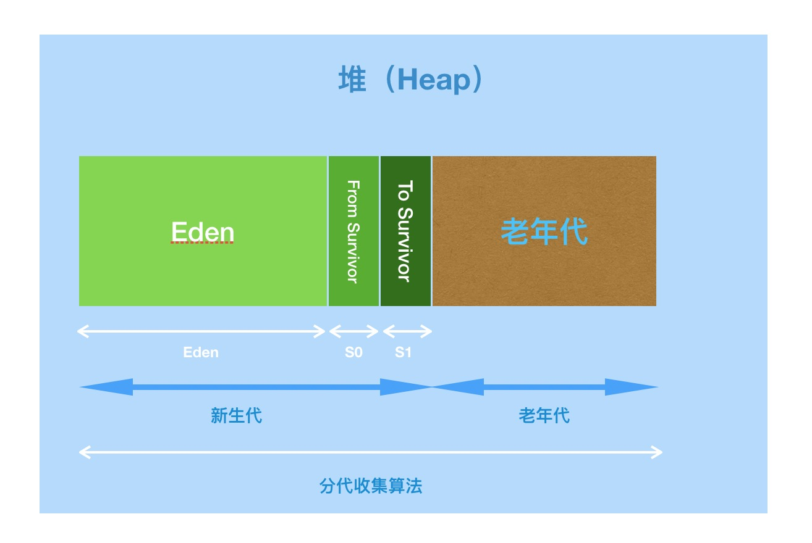

[toc]

# 目录

## JVM整体结构图


## JVM的生命周期

- 虚拟机的启动：Java虚拟机的启动是通过类加载器（BootstrapClassLoader）创建一个初始化类来完成的，这个类是由虚拟机的具体实现指定的

- 虚拟机的运行：
  - 程序开始执行时他才运行，程序结束时他就停止
  - 一个运行中的虚拟机对应一个系统进程

- 虚拟机的停止：
  - 程序正常执行结束
  - 程序执行过程中遇到了异常或错误而异常终止
  - 由于操作系统出现错误而导致虚拟机进程终止
  - 某线程调用Runtime或System类的exit方法，或Runtime的halt方法，并且Java安全管理器也允许这次操作
  - 本地方法接口


## 类装载子系统

### 类加载器是什么？
> 类加载器是jre(java runtime environment)的一部分，负责动态将类加载到Java虚拟机。


### 双亲委派机制

> 当一个类加载器收到一个类加载请求时，该加载器首先会把加载请求委派给父类加载器。只有父类加载器在自己的搜搜范围内找不到指定的类时，子类加载器才会尝试自己加载。
#### 双亲委派机制流程
1. 当AppClassLoader收到一个类加载请求时，首先检查是否加载过，如未加载委派给父加载器（ExtClassLoader）加载；
2. 当ExtClassLoader收到一个类加载请求时，首先检查是否加载过，如未加载委派给父加载器（BootstrapClassLoader）加载；
3. 当BootStrapClassLoader收到一个加载请求时，首先检查是否加载过，如未加载，则尝试加载，加载失败时，则会回归到ExtClassLoader尝试加载；
4. 当ExtClassLoader也加载失败，就会使用AppClassLoader尝试加载；
5. 当AppClassLoader也加载失败，就会使用自定义类加载器尝试加载；
6. 如果上述加载过程均失败，则会抛出 ==ClassNotFoundException== 。


#### 双亲委派机制的好处

- 可以避免类的重复加载
- 保护程序安全，防止核心API被随意篡改：当自定义类为java.lang.String时，类加载会报错

#### 沙箱安全

> 自定义类的包名、类名与jdk自带的包名、类名冲突的话，编译时会报错。如：自定义类java.lang.String、java.lang.HelloWorld

`java.lang.SecurityException: Prohibited package name: java.lang`


### 类加载器的加载步骤
- 装载：本地系统加载、网络获取（Web Applet）、压缩包（jar/war）读取、运行时生成（动态代理技术）等

    - 通过一个类的全限定名获取定义此类的二进制字节流
    - 将这个字节流所代表的静态存储结构转化为方法区的运行时数据结构
    - 在内存中生成一个代表这个类的java.lang.Class对象，作为方法区这个类的各种数据的访问入口

- 链接：执行下面的校验、准备和解析步骤，其中解析步骤是可以选择的；//包含了虚方法表的初始化

    - 验证：确保class文件的字节流中包含信息符合当前虚拟机要求，保证被加载类的正确性，不会危害虚拟机自身安全。主要包括四种验证：文件格式验证、元数据验证、字节码验证、符号引用验证
    - 准备：
        - 为类变量（静态变量）分配内存并且设置该类变量的默认初始值，即为 0（数值型），引用类型为 null
        - 这里不包含用final修饰的static，因为final在编译的时候就会分配了，准备阶段会显示初始化
        - 这里不会为实例变量分配初始化，类变量会分配在方法区中，而实例变量是会随着对象一起分配到Java堆中
    - 解析：
        - 将字节码文件常量池中的符号引用转换为直接引用（直接指向目标的指针、相对偏移量或一个间接定位到目标的句柄）
        - 事实上，解析操作往往会在jvm执行完初始化之后再执行的
        - 解析动作主要针对类或接口、字段、类方法、接口方法、方法类型等。

- 初始化：

    - 初始化阶段就是执行类构造器方法`<clinit()>`的过程，此方法不需要定义，是javac编译器自动收集类中的所有类变量的赋值动作和静态代码块中的语句合并而来。构造器方法中的指令按照语句在源文件中出现的顺序执行
    - `<clinit>()`不同于类的构造器，构造器在字节码文件中体现为`<init>()`方法
    - 若该类具有父类，jvm会保证子类的`<clinit>()`执行前，父类的`<clinit>()`已经执行完毕
    - 虚拟机必须保证一个类的`<clinit>()`方法在多线程下被同步加锁

    ```java
    public class Test {
    	private static int n = 1;
        static {
            n = 2;
            m = 20;
        }
        private static int m = 10; //链接：准备（m=0）-> 初始化（m=20） -> 10
        
        public static void main(String[] args) {
            System.out.println(n); //2
            System.out.println(m); //10
        }
    }
    ```

    

### 自定义类加载器

> 继承ClassLoader，实现findClass方法。如果没有特殊要求（如：自定义读入方式或字节码解密过程），也可以继承URLClassLoader

#### 为什么需要自定义类加载器？

- 隔离加载类：中间件和应用模块隔离，包路径、类名冲突，类仲裁
- 修改类加载的方式：Bootstrap加载器是必须的，其他加载器不是必须的
- 扩展加载源：
- 防止源码泄露：字节码文件编译时如果实现了加密，在自定义类加载器中实现解密

#### 获取类加载器的方式

- `String.class.getClassLoader()`

- `Thread.currentThread().getContextClassLoader()`
- `ClassLoader.getSystemClassLoader()`


## 运行时数据区


### 线程

- 线程是一个程序里的运行单元。JVM允许一个应用有多个线程并行的执行
- Hotspot JVM中，每个线程都与操作系统的本地线程直接映射。当Java线程准备好执行以后，此时一个操作系统的本地线程也同时创建，Java线程执行终止后，本地线程也会回收
- 操作系统负责所有线程的安排调度到任何一个可用的CPU上。一旦本地线程初始化成功，它就会调用Java线程中的`run()`方法

#### JVM系统线程（Hotspot）

- 虚拟机线程：这种线程操作是需要JVM达到安全点才会出现。执行类型包括：`stop-the-world`的垃圾收集、线程栈收集、线程挂起、偏向锁撤销
- 周期任务线程：时间周期事件的体现（如：中断）
- GC线程：对JVM里不同种类的垃圾收集行为提供支持
- 编译线程：运行时会将字节码编译成本地代码
- 信号调度线程：接收信号并发送给JVM，内部通过调用适当的方法进行处理


### PC寄存器（程序计数器）

> 线程私有（生命周期随线程），较小的内存，线程所执行字节码的行号指示器。字节码解释器工作时就是通过改变这个计数器的值来选取下一条需要执行的字节码指令

- 包括分支、循环、跳转、异常处理、线程恢复等基础功能都需要依赖这个计数器来完成
- 线程执行java方法时，计数器记录的是正在执行的字节码指令地址，如果执行的是本地方法，计数器则为空（Undefined）。字节码解释器工作时，就是通过改变这个计数器的值来选取下一条需要执行的字节码指令
- 此内存区域是唯一一个在Java虚拟机规范中没有规定任何OutOfMemoryError情况的区域


### 虚拟机栈（Java栈）

> 线程私有（生命周期随线程），描述的是方法执行的内存模型，每个方法执行的同时都会创建一个栈贞用于存放局部变量表、操作数栈、动态链接、方法出口等信息。每个方法从调用直至执行完成的过程，就对应一个栈贞在虚拟机栈中入栈到出栈的过程

- 栈的大小决定方法的调用深度。栈的大小允许设置为动态和固定大小，栈的固定大小设置：-Xss256k
- 虚拟机规范中，对这个区域规定了两种异常情况：
  - 如果线程情况的栈深度大于虚拟机所允许的深度时，将抛出StackOverflowError异常
  - 在虚拟机允许动态扩展的情况下，如果扩展时无法申请到足够的内存，则会抛出OutOfMemoryError异常

#### 栈桢的内部结构

##### 局部变量表（Local Variables）

- 定义为数字数组，主要用于存储方法参数和定义在方法体内的局部变量，这些数据类型包括基本数据类型、对象引用类型、方法返回地址
- 局部变量表为线程私有数据，所以不存在数据安全问题
- 局部变量表所需要的容量大小是在编译期就确定下来的，并保存在方法的Code属性的maximum local variables数据项中。方法运行期间不会改变局部变量表的大小
- 对一个方法而言，它的参数和局部变量越多，使得局部变量表膨胀，它的栈贞就越大，占用栈的空间就越大，从而导致方法嵌套调用的次数会减少。栈调优最大可调整的也在局部变量表
- 随着方法栈贞的销毁，局部变量表也会随之销毁
- 局部变量表最基本的存储单元是变量槽（Slot），32位长度以内的类型只占用一个slot（包含引用类型），64位的类型（long和double）占用两个slot
  - 如果栈贞对应的方法为构造方法或实例方法，那么局部变量表索引值为0的位置会存放对象引用this
  - 变量槽（slot）允许重复利用，当方法中的变量出了作用域，则slot会被重复利用。如：逻辑块中声明的变量，出了逻辑块就代表作用域结束

##### 操作数栈（Operand Stack）

> 或叫表达式栈

- 使用数组实现，方法栈贞创建的时候，这个方法的操作数栈是空的
- 操作数栈都有明确的栈深度用于存储数值，所需最大深度是在编译期就确定下来的，并保存在方法的Code属性的max_stack的值
- 栈元素可以是任意的Java数据类型。32位占用一个栈单位深度，64位占用两个栈单位深度
- 操作数栈配合执行引擎工作

```java
//源码
public int test() {
	int m = 15;
	int n = 8;
	int k = m + n;
	return k;
}
```

```java
//字节码指令执行的过程（执行引擎+PC寄存器+局部表量表+操作数栈的协同工作流程）
 0 bipush 15	//把15压入操作数栈
 2 istore_1		//15从操作数栈出栈，放到局部变量表索引为1的位置（0存放的this）
 3 bipush 8		//把8压入操作数栈
 5 istore_2		//8从操作数栈出栈，放到局部变量表索引为2的位置
 6 iload_1		//把局部变量表索引为1的数放入操作数栈
 7 iload_2		//把局部变量表索引为2的数放入操作数栈
 8 iadd			//从操作数栈出栈两个数，进行add计算，将计算结果放入操作数栈
 9 istore_3		//23从操作数栈出栈，放到局部变量表索引为3的位置
10 iload_3		//把局部变量表索引为3的数放入操作数栈
11 ireturn
```

- 栈顶缓存技术（Top-of-Stack Cashing）：将栈顶元素全部缓存在物理CPU的寄存器中，以此降低对内存的读写次数，提升执行 引擎的执行效率

##### 动态链接（Dynamic Linking）

> 或叫指向运行时常量池的方法引用

- 将符号引用转换为调用方法的直接引用。字节码文件中，符号引用指向字节码文件常量池中的常量，当方法运行，动态链接将符号引用指向直接引用（运行时常量池）

##### 方法返回地址（Return Address）

>  或叫方法正常退出或异常退出的定义

- 存放调用该方法的字节指令行号，也就是PC寄存器的值
- 方法结束的方式分为：
  - 正常执行完成：调用者的PC寄存器的值作为返回地址，即调用该方法的指令的下一条指令的地址
  - 异常执行结束，非正常退出：异常退出，返回地址是要通过异常表来确定的，栈贞一般不保存这部分信息

##### 一些附加信息

> 栈贞中还允许携带与JVM实现相关的一些附加信息。例如：对程序调试提供支持的信息。可选

> 桢数据区：动态链接、方法返回地址、附加信息


#### 方法的调用

##### 方法的绑定机制

> 符号引用转换为调用方法的直接引用与方法的绑定机制相关

- 静态链接（早期绑定）：被调用的目标方法在编译期可以确定，且在运行期不会发生改变时，将调用方法的符号引用转换为直接引用的过程称为静态链接
- 动态链接（晚期绑定）：被调用的目标方法在编译期无法确定下来，只能够在程序运行期将调用方法的符号引用转换为直接引用，这种引用转换过程具有动态性，因此称为动态链接

##### 虚方法与非虚方法

- 非虚方法
  - 如果方法在编译期就确定了具体的调用版本，这个版本运行时是不可变的，这样的方法称为非虚方法
  - 静态方法（static）、私有方法（private）、final方法、实例构造器、父类方法都是非虚方法
  - 其他方法称为虚方法
- 虚方法：不满足非虚方法要求的，都是虚方法

##### 虚方法调用指令

- invokestatic：调用静态方法，解析阶段确定唯一方法版本。一定为非虚方法
- invokespecial：调用`<init>`方法、私有及父类方法，解析阶段确定唯一方法版本。一定为非虚方法
- invokevirtual：调用所有虚方法。final修饰的方法不确定
- invokeinterface：调用接口方法

- invokedynamic：动态指令，为保持java的动态性。


#### 相关题目

##### 栈溢出的情况

> StackOverflowEerror，通过-Xss设置栈的大小。如果可以动态扩容，当申请空间不足，就会抛出OOM（OutOfMemoryError）

##### 调整栈大小，就能保证不出现溢出吗？

> 不能，如果递归方法调用没有出口，最终还是会出现溢出。栈的大小调整，只能让方法调用深度更深一些

##### 分配的栈内存越大越好吗？

> 不是，会挤占其他内存空间的大小，可以使用的线程数也会减少

##### 垃圾回收会设计到栈空间吗？

> 不会，栈空间属于线程私有，随着线程执行结束而销毁。栈里面的存储元素为栈贞，栈贞对应方法，每个方法执行完，栈贞就将出栈，因此不需要垃圾收回

##### 方法中定义的局部变量是否线程安全？

> 具体问题具体分析，主要看变量（包括局部变量、形参）有没有发生逃逸，如果逃逸就不是线程安全的


### 本地方法栈

> 线程私有，管理本地方法调用。与虚拟机栈一样，允许动态扩容和设置固定大小
>
> Hotspot中将本地方法栈和虚拟栈合二为一了


### 方法区

> 线程共享，虚拟机启动的时候创建，停止的时候销毁。主要存储类的结构信息：运行时常量池、字段和方法数据，以及方法和构造函数的代码，包括在类和实例初始化以及接口初始化中使用的特殊方法
>
> 方法区是JVM规范，Hotspot中的实现是永久代（jdk8以前）和元空间（jdk8）

- jdk8取消了永久代，取而代之的是元空间，元空间不再与堆连续，而是存在于本地内存（C-Heap）
- 因为元空间存在于本地内存，所以只要本地内存足够，它就不会像永久代那样因为申请空间不足抛出OutOfMemoryError: PermGen space的异常
- 默认在本地内存足够的情况下，元空间可以不断膨胀，但为了合理使用它，JVM提供了如下参数：
  - -XX:MetaspaceSize：初始化空间大小，第一次超过这个值时触发垃圾回收，同时GC会对该值进行调整，如果释放了大量的空间，就会适当调低该值，如果释放了很少的空间，那么在不超过MaxMetaspaceSize（如果设置了该值）的情况下，适当调高该值
  - -XX:MaxMetaspaceSize：可为元数据区分配的本机内存的最大值。默认情况下，大小没有限制
  - -XX:MinMetaspaceFreeRatio：GC之后，最小的元数据区剩余空间容量的百分比
  - -XX:MaxMetaspaceFreeRatio：GC之后，最大的元数据区剩余空间容量的百分比

#### 运行时常量池

>  方法区的一部分，字节码文件中除了有类的版本、字段、方法接口等描述信息外，还有一项信息是常量池，用于存放编译期生成的各种字面量和符号引用（此时在文件中），这部分内容将在类加载后进入运行时常量池中存放（此时存放在内存中）。运行时常量池是全局共享的，多个类公用一个运行时常量池，多个字节码文件中常量池多个相同的字符串在运行时常量池只会存放一份

- 字面量：文本字符串（如：String a = "hello";//"hello"为字面量）、被final修饰的变量
- 符号引用：
  - 类和接口的全限定名：如String这个类，全限定名就是 java/lang/String
  - 字段名称和描述符：类或接口中声明的变量，包括类级别变量（static）和实例级变量
  - 方法名称和描述符：方法的参数类型+返回值类型


### 堆（GC堆）

> 线程共享，虚拟机启动的时候创建，停止的时候销毁。Java虚拟机所管理的内存中最大的一块。用于存放对象实例，几乎所有对象实例在这里分配内存（JIT的发展与逃逸分析的成熟，包括栈上分配、标量替换的优化技术，导致对象部分在堆上分配也渐渐变得不是那么绝对了）。堆可以处于物理不连续的内存空间中



#### 分代管理策略

> 堆是垃圾收集器主要工作的区域。为了更好的回收性能，JVM将堆进行分代管理

- 新生代

  - 分为三个区：Eden、From Survivor（S0）、To Survivor（S1）
  - 三个区的内存划分比例为：8：1：1
  - 正常情况下，新建对象分配在Eden区，存活对象在S0或S1
    - 第一次GC，Eden区，仍然存活的对象，被复制到S0
    - 第二次GC，Eden区和S0区，仍然存活的对象，被复制到S1
    - S0到S1的每次复制，对象年龄加一，经过多次的回收，仍然存活且年龄达到指定值时，对象进入老年代

  > YGC又称MinorGC

- 老年代

  > FullGC


#### 堆参数设置

| 参数名           | 默认值   | 说明                                                         |
| ---------------- | -------- | ------------------------------------------------------------ |
| MinHeapFreeRatio | 40%      | 设置GC事件后，允许的最小空闲堆空间百分比(0到100)。如果空闲堆空间低于此值，则堆将被扩展 |
| MaxHeapFreeRatio | 70%      | 设置GC事件后，允许的最小空闲堆空间百分比(0到100)。如果空闲堆空间低于此值，则堆将被收缩 |
| -Xms             | 6656k    | 初始化堆内存                                                 |
| -Xmx             | 计算得出 | 最大堆内存。-Xms与-Xmx设置相同的值，可提高可预测性           |
| NewRatio         | 2        | 年轻代大小限制。默认-XX:NewRatio=2，那么年轻代和老年代的比例1：2，换句话说，年轻代是堆总大小的三分之一 |
| NewSize          | 1310M    | 年轻代初始化堆内存（等效于-Xmn）。太小容易频繁的MinorGC，太大，只能在FullGC时回收，而FullGC比较耗时 |
| MaxNewSize       | 不限     | 年轻代最大堆内存                                             |
| SurvivorRatio    | 8        | Eden区与Survivor区内存比例。默认-XX:SurvivorRatio=8，那么Eden与两个Survivor的比例为8：1：1，换句话说，每个幸存者区是年轻代总大小的十分之一 |


## 本地方法接口

### 什么是本地方法？

> 一个Native Method就是一个Java调用非Java代码的接口。
>
> 例如：`public final native Class<?> getClass()`

- 与Java外的环境交互
- 与操作系统交互


## 执行引擎

### 解释执行（Interpreter）

> 当程序启动时候，解释器首先发挥作用，省去编译时间，立即执行。将字节码指令逐条编译为机器指令执行，保证了响应时间

### 编译执行（JIT Compiler）

> 把程序中的热点代码编译成机器指令集，并缓存到本地方法区


### 垃圾收集（Garbage Collection）

#### 确定对象已死？

##### 引用计数

> 一个对象new出来，在对象头部记录一个计数，每增加一次引用，计数加一，引用释放时，计数减一，当计数为零时为可以回收的垃圾对象。
>
> 可能存在循环引用的问题，如：A->B B->A

##### 可达性分析

> 根搜索，正向可达。确定根对象，从根对象向下搜索，当一个对象没有任何引用链相连（从根对象到这个对象不可达）时，证明此对象是不可用的。根对象（GC Roots）包含：

- 虚拟机栈（栈贞的本地变量表）中引用的对象
- 方法区中类变变量引用的对象
- 方法区中常量引用的对象
- 本地方法栈中本地方法引用的对象


#### 对象非死不可？

> 即使在可达性分析算法中不可达的对象，也并非是“非死不可”的，这时候它们暂时处于“缓刑”阶段，要真正宣告一个对象的死亡，至少要经历两次标记过程：如果对象在可达性分析后发现没有与GC Roots相连，那么它将会被第一次标记并且进行一次筛选，筛选的条件是此对象是否有必要执行finalize()方法。当对象没有覆盖finalize()方法，或者finalize()方法已经被虚拟机调用过，虚拟机将这两种情况视为“没有必要执行”。

> 如果这个对象被判定为有必要执行finalize()方法，那么这个对象将会放置在一个队列（F-Queue）中，并在稍后由一个虚拟机自动创建的、低优先级的Finalizer线程去执行它。虚拟机会触发它，但不会等待它执行结束，原因是，如果一个对象在finalize()方法中执行缓慢，或者发生死循环，那么会导致队列中的其他对象永久等待，导致整个内存回收系统崩溃。
>
> finalize()方法是对象逃脱死亡命运的最后一次机会，GC会对F-Queue中的对象进行第二次小规模的标记，如果对象要在finalize()方法中拯救自己，那么只要重新与根引用链关联即可，如把自己（this）赋值给某个类变量或对象成员变量，这样再第二次标记时，它将被移除即将回收的集合。如果对象这时候还没有逃脱，那基本上它就真的要被回收了。

```java
/**
 * 此代码演示了两点： 
 * 1.对象可以在被GC时自我拯救。 
 * 2.这种自救的机会只有一次，因为一个对象的finalize()方法最多只会被系统自动调用一次
 */
public class FinalizeEscapeGC {

    public static FinalizeEscapeGC SAVE_HOOK = null;
    public void isAlive() {
        System.out.println("yes, i am still alive :)");
    }

    @Override
    protected void finalize() throws Throwable {
        super.finalize();
        System.out.println("finalize mehtod executed!");
        FinalizeEscapeGC.SAVE_HOOK = this;
    }

    public static void main(String[] args) throws Throwable {
        SAVE_HOOK = new FinalizeEscapeGC();

        //对象第一次成功拯救自己
        SAVE_HOOK = null;
        System.gc();
        // 因为Finalizer方法优先级很低，暂停0.5秒，以等待它
        Thread.sleep(500);
        if (SAVE_HOOK != null) {
            SAVE_HOOK.isAlive();
        } else {
            System.out.println("no, i am dead :(");
        }

        // 下面这段代码与上面的完全相同，但是这次自救却失败了
        SAVE_HOOK = null;
        System.gc();
        // 因为Finalizer方法优先级很低，暂停0.5秒，以等待它
        Thread.sleep(500);
        if (SAVE_HOOK != null) {
            SAVE_HOOK.isAlive();
        } else {
            System.out.println("no, i am dead :(");
        }
    }
}
//运行结果：
// finalize mehtod executed ! 
// yes,i am still alive : ) 
// no,i am dead : (
```

> 注：finalize()方法的设计是早起为了迎合C/C++程序猿的开发习惯。运行代价高昂，不确定性大，所以强烈不推荐重写该方法


#### 方法区回收

> JVM规范中并没有要求虚拟机在方法区实现垃圾收集。而且在方法区进行垃圾收集的效率很低
>
> 方法区的垃圾收集主要分为两部分：

- 废弃的常量
- 无用的类
  - 该类所有的实例都已经被回收，也就是堆中不存在该类的任何实例
  - 加载该类的ClassLoader已经被回收
  - 该类对应的java.lang.Class对象没有再任何地方被引用，无法在任何地方通过反射访问该类的方法


#### YGC、FullGC触发条件

- YGC（MinorGC）：Eden区空间不足
- FullGC
  - System.gc()：-XX:+DisableExplicitGC 可以显式的禁用
  - 老年代空间不足：OutOfMemoryError：Java heap space
  - 方法区空间不足：OutOfMemoryError: PermGen space
  - MinorGC晋升FullGC：MinorGC前，统计平均晋升大小比目前老年代剩余空间大，则不会触发MinorGC，而是直接触发FullGC
  - Eden区满，From Space向To Space复制时，对象大小大于To Space的可用空间，则把该对象转存到老年代


#### 垃圾收集算法

##### 标记清除（Mark-Sweep）

> 分为两个阶段：标记和清除。首先找到垃圾对象进行标记，然后进行统一回收
>
> 缺点：清除之后，会产生大量不连续的内存碎片，当程序再想分配大对象时，无法找到足够的连续内存，从而不得不提前触发另一次垃圾收集动作

##### 复制（Copying）

> 将内存一分为二，每次只用一半。回收的时候，将存活对象复制到另外那一半，然后回收当前这一半。新生代幸存者区使用这种回收方式
>
> 优点：实现简单，运行效率高
>
> 缺点：内存空间浪费

##### 标记压缩（Mark-Compact）

> 基于标记清除，在回收阶段不是直接收回垃圾对象，而是对所有存活的对象向一端移动，然后直接回收掉端边界以外的内存。老年代使用这种回收方式
>
> 比复制算法效率稍低

##### 分代收集（Generational Colletion）

> 根据对象的存活周期将内存划分几块，一般为新生代和老年代，这样可根据各个年代的特点采用最适当的收集算法。新生代中，每次垃圾收集有大批对象死去，只有少量存活，所以选用复制算法，只需要付出少量存活对象的复制成本就可以完成收集。而老年代中因为对象存活率高、没有额外空间对它进行分配担保，所以，就必须使用标记清除或标记整理的算法来进行回收


#### 垃圾收集器（Garbage Collector）


##### 常用组合（分代回收）

- Serial + Serial Old

- ParNew + CMS

- Parallel Scavenge + Parallel Old

##### Serial

> 单线程串行收集器。在年轻代使用，采用复制算法。在垃圾收集时，必须暂停其他所有工作线程，直到它收集结束，这个过程称为SWT（stop-the-world）

##### Serial Old

>单线程串行收集器。在老年代使用，采用标记整理算法。同样会有SWT的问题

##### ParNew

> 多线程并行收集器。在年轻代使用，采用复制算法。同样会有SWT的问题，相对串行收集器，停顿时间要短。新生代收集器，只有它能和CMS收集器配合工作（因为jdk1.4和1.5的差别，导致CMS无法和Parallel Scavenge新生代收集器配合工作）。
>
> 单CPU环境中，ParNew收集器不一定比Serial收集器效果更好，因为ParNew收集器会带来多线程交互的开销。默认开启的收集线程数与CPU的数量相同。在CPU非常多的情况下，可以使用-XX:ParallelGCThreads指定垃圾收集线程数

##### CMS

> 并发标记清理（Concurrent Mark Sweep）。在老年代使用，采用标记清除算法。jdk1.5推出，第一次出现回收线程和工作线程可以同时运行的垃圾收集器。以最短收回停顿为目标的收集器，响应时间优先
>
> 开启：-XX:+UseConcMarkSweepGC

- **初始标记**：找出根对象能直接关联到的对象进行标记，需要stop-the-world
- **并发标记**：多线程并发对根对象进行搜索，然后标记出垃圾对象。工作线程同时运行
- **重新标记**：修正在并发标记阶段因工作线程的同时运行而导致标记产生变动的那一部分对象的标记记录。需要stop-the-world。这个过程比初始化标记时间长，比并发标记时间短
- **并发清除**：多线程并发清除。工作线程同时运行

> CMS的缺陷：

- CPU资源占用：由于CMS是多线程并发收集器，所以回收线程会根据CPU的增加而增加，这样造成抢占工作线程的CPU资源
  - 默认启动的回收线程数是（CPU数量+3）/4。**CPU数量低于4个时，CMS对用户程序的影响就可能变得很大**，CG线程占用资源的时间变得更长
- 无法处理**浮动垃圾**：
  - 由于CMS并发标记时，工作线程同时在运行，在并发标记后，工作线程还可能产生新的垃圾，这部分垃圾没有被标记，CMS无法在本次收集中处理掉它们，只好留到下一次GC时再清理。这部分垃圾称为浮动垃圾
  - CMS收集器不能像其他收集器那样等到老年代几乎被填满再进行收集，需要预留一部分空间提供给并发收集时工作线程的运作。默认当老年代使用了**70%**的空间后会激活CMS收集器。这是个保守的设置，如果应用程序中老年代增长速度不是很快，那么可以适当调整参数-XX:CMSInitiatingOccupancyFraction的值来提高触发的百分比，以便降低内存回收次数，从而获得更好的性能
  - **CMS收集器预留的空间无法满足程序运行需要时，就会出现一次“Concurrent Mode Failure”失败，这时虚拟机将启动备用预案：临时启动Serial Old收集器来重新进行老年代的垃圾收集，这样会使停顿的时间更长。所以-XX:CMSInitiatingOccupancyFraction设置太高容易导致大量的“Concurrent Mode Failure”失败，性能反而降低**
- 内存碎片化：由于CMS基于**标记清除**的算法实现，回收结束会有大量的内存碎片产生。碎片过多，往往会出现老年代还有很大的内存空间，但是无法找到足够大连续空间来分配当前对象，以至于不得不提前触发FullGC。为解决这个问题，CMS提供了参数设置：
  - -XX:+UseCMSCompactAtFullCollection：为解决内存碎片化的问题。当空间不足，要进行FullGC时开启内存碎片的合并整理过程。合并整理过程是无法并发的，空间碎片问题没了，但停顿时间不得不变长。默认是开启的
  - -XX:CMSFullGCsBeforeCompaction：为优化由于碎片整理带来的长时间停顿，这个参数可以指定执行多少次不压缩的FullGC后，跟着执行一次带压缩的。默认值为0，表示每次进入FullGC时都进行碎片整理

##### Parallel Scavenge

> 多线程并行收集器。在年轻代使用，采用复制算法。

##### Parallel Old

> 多线程并行收集器。在老年代使用，采用标记整理算法。与Parallel Scavenge配合工作，是一对吞吐量优先的组合

#### G1

> Garbage First（垃圾优先）。G1设计目标是取代CMS收集器，相比CMS，G1的停顿时间更可控，因为G1添加了预测机制，用户可以指定期望的停顿时间

- -XX:+UseG1GC：开启G1收集器
- -XX:G1HeapRegionSize：单个Region大小，取值范围1M~32M，且为2的指数。目标是基于最小的Java堆大小具有大约2048个区域。如不设定，G1默认根据Heap大小自动决定
- -XX:MaxGCPauseMillis：用户期望SWT时间，默认200ms
- -XX:G1NewSizePercent：最小年轻代设置，默认堆内存的5%
- -XX:G1MaxNewSizePercent：最大年轻代设置：堆内存的60%
- -XX:ParallelGCThreads：并发收集线程数。cpu在8核及以内，设置为cpu数量。cpu超过8核，设置为核数的5/8，比如：32核，线程数就为 20
- -XX:InitiatingHeapOccupancyPercent：触发标记的阈值，堆内存的45%

> 大小超过Region大小的3/4的对象会作特殊处理，分配到一个或多个连续Region构成的区域

- 初始标记：找出根对象能直接关联到的对象进行标记，需要stop-the-world
- 并发标记：多线程并发对根对象进行搜索，然后标记出垃圾对象。工作线程同时运行
- 最终标记：修正在并发标记阶段因工作线程的同时运行而导致标记产生变动的那一部分对象的标记记录。需要stop-the-world。这个过程比初始化标记时间长，比并发标记时间短
- 清除垃圾：清除掉没有存活对象的Region区域

> 与CMS类似，工作线程运行的速度大于回收垃圾的速度，可能会导致没有足够的空间让工作线程使用，此时会出现**并发模式失败**的情况。在G1中，回收压缩时，在迁移有效对象没有足够的空间时，也会发生分配失败的错误

##### SATB

> Snapshot-At-The-Beginning，GC开始时活着的对象的一个快照。作用是维持GC的正确性，采用三色标记。

- 三色标记
  - 白：对象没有被标记到，标记阶段结束后，会被当做垃圾回收掉
  - 灰：对象被标记了，但是它的field还没有被标记或标记完
  - 黑：对象被标记了，且它的所有field也被标记完了

> 三色标记还是会出现漏标，这种漏标的对象，被称为浮动垃圾。本次标记会让它躲过GC

##### RSet

> CSet（Collection Set）记录GC要收集的Region集合，集合里的Region可以是任意年代的。
>
> RSet（Remembered Set）逻辑上说每个Region都有一个RSet，它记录其他Region中的对象引用本Region中对象的关系（谁引用了我的对象）。RSet其实是一个HashTable，Key是别的Region的起始地址，Value是一个集合，里面的元素是CardTable的Index


## JVM调优

### 什么是调优？

- 根据需求进行JVM规划和与调优
- 优化JVM运行环境（慢、卡顿）
- 解决JVM运行过程中出现的各种问题（OOM）


### 调优的指标

- 吞吐量：垃圾收集的时间和总时间的占比。用户时间/(用户时间 + GC时间) = 吞吐量
- 响应时间：STW越短，响应时间越好。G1允许设置用户期望的STW时间 -XX:MaxGCPauseMillis


### GC调优步骤

- 了解业务场景追求的是什么？是要响应优先，还是吞吐量优先？
- 选择最合适的收集器组合（没有最好的，只有最合适的）
- 分析计算内存需求
- 设定年代大小、升级年龄
- 设置GC日志参数
  - 按文件大小切割，打印GC详细日志
  - 或每天产生一个日志文件
  - `-XX:+PrintGCDetails -XX:+PrintGCDateStamps -XX:+PrintGCDateStamps -Xloggc:./gc.log`
- 分析日志：得到日志中的关键性指标
- 分析GC原因，调优JVM参数
  - 不同的优化方案部署到不同的机器上，不断观察，不断调整，最终找到合适的选择


### 案例

#### 还款账单生成

- 系统响应时间慢，cpu飙升

> 扩容后，Minor GC时增加了（扫描时间），但省去T2（复制对象）的时间，更重要的是对于虚拟机来说，复制对象的成本要远高于扫描成本，所以，**Minor GC时间更多取决于GC后存活对象的数量，而非Eden区的大小**。因此如果堆中短期对象很多，那么扩容新生代，单次Minor GC时间不会显著增加。


> 判断系统架构和代码还有没有优化的空间，因为不可能通过GC优化使得系统性能达到一个质的飞越


### 常用工具

#### JDK自带命令

- java -XX:+PrintCommandLineFlags -version //当前命令行配置

- jps -l //查看java进程
- jstat -gc 进程号 //堆内存情况
- jstat -gc 进程号 采样间隔（动态） //堆内存情况

- jstack 进程号 |more //某一个进程下所有线程运行情况
- jmap -heap 进程号 //显示堆详细信息
- jmap -histo:live 进程号 //显示对中对象的统计信息
- jmap -dump:format=b,file=heapdump.phrof 进程号 //生成堆转储文件

#### Arthas

- java -jar arthas-boot.jar
- dashboard
- jvm
- thread
- sc
- sm
- trace
- jda


### 常用命令行参数

#### Hotspot参数分类

> 标准：- 开头，所有的Hotspot都支持
>
> 非标准：-X 开头，特定版本Hotspot支持特定命令
>
> 不稳定：-XX 开头，下一个版本可能被取消。使用 `java -XX:+PrintFlagsFinal` 查看全部参数

#### 常用参数：

> -Xms：初始化
>
> -XX:PretenureSizeThreshold：在使用Serial和ParNew垃圾收集器时可以指定Eden区大对象的阈值，如果超过直接被分配到老年代


## 对象的创建

### 引用的分类

- 强引用：GC时不会被回收
- 软引用：描述有用但不是必须的对象，在发生内存溢出异常之前被回收
- 弱引用：描述有用但不是必须的对象，在下一次GC时被回收
- 虚引用（幽灵引用/幻影引用）:无法通过虚引用获得对象，用PhantomReference实现虚引用，虚引用用来在GC时返回一个通知。


### 对象内存中布局


> 总的长度要能被8整除，64位操作系统（64位寄存器），提高寄存器的读取效率

- markword：8个字节，包含锁信息（无锁、偏向所、自旋锁、重量级锁），分代年龄（PS+PO：15，CMS：6）
- class pointer：4个字节
- instance data：
- padding：补齐能被8整除的剩余字节数

> Object o = new Object(); 占多少字节
>
> new Object()：16个字节
>
> o：普通对象指针占4个字节。不开启压缩指针的话，占8个字节（64位机器）
>
> -XX:+PrintCommandLineFlags
>
> -XX:+UseCompressedClassPointers：压缩类指针（默认开启）
>
> -XX:+UseCompressedOops：压缩对象指针


### 对象怎么定位

- 句柄方式：句柄池中包含类型数据指针和实例数据指针
- 直接指针


### 对象怎么分配（Hotspot）


- 栈上分配
  - 线程私有小对象
  - 无逃逸
  - 支持标量替换
  - 无需调整

- 线程本地分配TLAB（Thread Local Allocation Buffer）
  - 占用Eden，默认1%
  - 多线程的时候不用竞争eden就可以申请空间，效率高。多线程同时申请要加锁
  - 小对象
  - 无需调整
- 老年代
  - 大对象
- Eden


### volatile关键字

> 适合多个线程读，一个线程写的场景（例如：HashMap，synchronized保证写，volatile保证读），volatile通过内存屏障实现了可见性和有序性

> CPU在执行指令时，势必会涉及到数据的读取和写入，而程序中的临时数据存放在主存（物理内存）当中，由于CPU执行速度很快，而从内存中读取和写入数据相对CPU执行的速度来说慢了很多，因此CPU里面就有了高速缓存，CPU在执行指令时，会从主存中复制这个数据到高速缓存中，在CPU执行这条指令的时候，只对自己缓存中的数据进行读取和修改，当指令结束时，才将高速缓存中的数据刷新到主存当中。

> 问题： 多核CPU，同时两个线程执行 i = i+1;i的初始值为0，我们期望无论什么情况下运算结果是两根线程执行完i=2，那么现实是这样吗？
>
> 假如线程1在CPU1中执行，从主存复制i到高速缓存，执行完i=1，将i刷新到主存，这时候线程2也在CPU2中执行完i=1，也将i刷新到主存，所以最终结果i=1，而并非i=2

- 可见性：在多线程的情况下，保证共享变量在修改时，能被及时更新到主存，在读取时，从主存读取新值

- 有序性：操作系统是允许指令重排序，当发生指令重排序时，可能会引起当线程2读取到线程1操作的半初始化状态的对象，volatile实现禁止指令重排序

  ```
  源码：
  class T {
  	int m = 8;
  }
  T t = new T();
  汇编码：
  0 new #2 <T> //(1)申请存储空间（m为半初始化状态）
  3 dup
  4 invokespecial #3 <T.<init>> //(2)调用构造方法
  7 astore_1 //(3)建立关联
  8 return
  申请内存 -> 赋默认值0(半初始化状态) -> 构造方法 -> 赋初始值8
  
  线程1:(1)执行完，(2)和(3)发生指令重排序
  线程2:在线程1指令重排序后，读取到了对象的半初始化状态，这时候m=0
  ```

> 在DCL(Double Check Lock)单例中，必须要加volatile，就因为对象存在半初始化状态


### happens-before

> 如果一个操作happens-before另一个操作，那么意味着第一个操作的结果对第二个操作可见，而且第一个操作的执行顺序将排在第二个操作的前面。 两个操作之间存在happens-before关系，并不意味着Java平台的具体实现必须按照happens-before关系指定的顺序来执行。如果重排序之后的结果，与按照happens-before关系来执行的结果一致，那么这种重排序并不非法（也就是说，JMM允许这种重排序）。

> 具体规则如下：

- 程序次序规则：一段代码在单线程中的执行结果是有序的。注意是执行结果，因为虚拟机、处理器会对指令重排序。虽然重排序，但是不影响代码的执行结果，所以程序最终的执行结果与顺序执行的结果是一致的。故而这个规则只对单线程有效，多线程环境下无法保证正确性。
- 锁定规则：多线程环境下，一个锁处于锁定状态，那么必须先执行unlock操作后，才能进行lock操作。
- volatile变量规则：一个线程去写一个volatile修饰的变量，然后另一个线程去读这个变量，那么写操作一定发生在读操作之前。
- 传递规则：A happens-before B，B happens-before C，那么A happens-before C
- 线程启动规则：如果线程A执行操作 ThreadB.start()（启动线程B），那么线程A的ThreadB.start()操作happen-before于线程B中的任意操作
- 线程终结规则：如果线程A执行操作ThreadB.join()并成功返回，那么线程B中的任意操作happen-before与线程A从ThreadB.join()操作成功返回


### 内存屏障

> 内存屏障其实也是一种JVM指令，Java内存模型的重排规则会要求Java编译器在生成JVM指令时插入特定的内存屏障指令，通过这些内存屏障指令来禁止特定的指令重排序。
>
> 内存屏障之前的所有写操作都要回写到主内存，内存屏障之后的所有读操作都能获得内存屏障之前的所有写操作的最新结果(实现了可见性)。因此重排序时，不允许把内存屏障之后的指令重排序到内存屏障之前。

| 屏障类型   | 指令示例                 | 说明                                                         |
| ---------- | ------------------------ | ------------------------------------------------------------ |
| LoadLoad   | Load1;LoadLoad;Load2     | 保证load1的读取操作在load2及后续读取操作之前执行             |
| StoreStore | Store1;StoreStore;Store2 | 在store2及其后续的写操作执行前，保证store1的写操作已刷新到主内存 |
| LoadStore  | Load1;LoadStore;Store2   | 在store2及其后续的写操作执行前，保证load1的读操作已读取结束  |
| StoreLoad  | Store1;StoreLoad;Load2   | 保证store1的写操作已舒心到主内存之后，load2及其后续的读操作才能执行 |


### 逃逸分析

> 如果一个资源的创建、使用、销毁在同一个线程内完成，且永远不会脱离该线程的控制，则该资源的使用就是线程安全的。

> 编译器利用逃逸分析，做如下优化：

- 同步省略：如果一个对象不会被多线程访问，那么针对这个对象的同步措施就可以省略，即锁消除。例如Vector和StringBuffer这样的类，他们种的很多方法都有锁的，当某个对象确定是线程安全的情况下，编译器会在编译这段代码时会进行锁消除来提升效率
- 标量替换：指无法再分解成更小粒度的数据，如基本类型（int/long等），相对如一个数据可以继续分解，则成为聚合量，如Java对象。在即时编译器编译过程中，经过逃逸分析，确定一个对象不会被其他线程或者方法访问，那么会将对象的创建替换成多个成员变量的创建，这个过程称为标量替换
- 栈上分配：指对象和数据不创建在堆上，而是创建在栈上，随着方法的结束自动销毁。JVM并没有实现站上分配，实际是用标量替换的方式替代实现的，当对象没有发生逃逸时，对象就可以通过标量替换分解为成员变量分配在栈上，和方法的生命周期一样，随着栈贞的出栈时销毁，减少GC压力，提高程序性能

> JVM是否开启逃逸分析（jdk7默认开启）：-XX:+DoEscapeAnalysis，显示分析结果：-XX:+PrintEscapeAnalysis


[回到顶部](#目录)