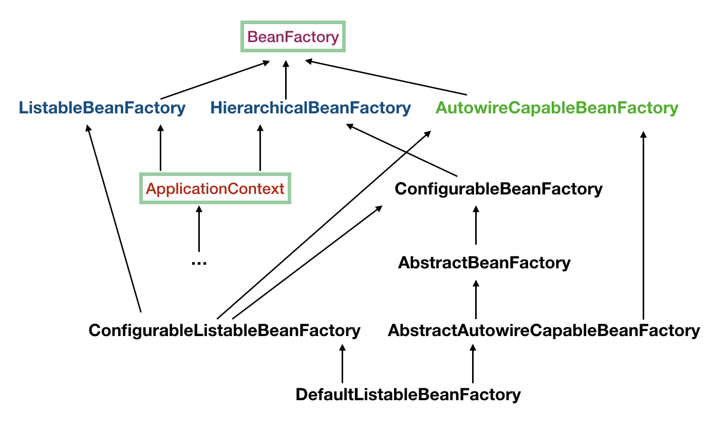
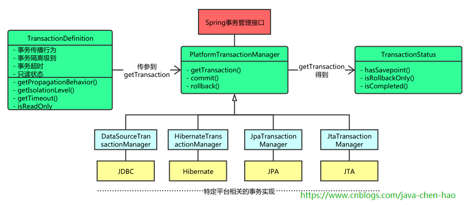

# 目录

[toc]

## spring-ioc

### ApplicationContext

> ApplicationContext 在启动的过程中，会负责创建实例Bean，往Bean中注入依赖

```java
	public static void main(String[] args) {
		AnnotationConfigApplicationContext ctx = new AnnotationConfigApplicationContext(AppConfig.class); //也可以直接指定包的扫描路径
		UserService userService = ctx.getBean(UserService.class);
	}
```


> Ioc容器的refresh方法

* prepareRefresh()：准备刷新上下文环境
  * 记录容器开启动时间
  * active 设置为 true
* obtainFreshBeanFactory()：获取告诉子类初始化Bean工厂
  * ListableBeanFactory（默认）
* prepareBeanFactory(x)：对bean工厂进行填充属性
  * 添加 ApplicationContextAwareProcessor 到beanFactory容器
    * EnvironmentAware
    * EmbeddedValueResolverAware
    * ResourceLoaderAware
    * ApplicationEventPublisherAware
    * MessageSourceAware
    * ApplicationContextAware
  * 注册environment（Environment）、systemProperties（Properties）、systemEnvironment（Map）
* postProcessBeanFactory(x)：留给子类容器去实现该接口
* **invokeBeanFactoryPostProcessors**(x)：调用Bean工厂后置处理器。依次按实现PriorityOrdered接口、实现Ordered接口和未实现排序接口的顺序执行Processor，每一种方式先进行内部排序，再执行
  * ConfigurationClassPostProcessor：
    * 根据配置类解析出更多的bean定义（postProcessBeanDefinitionRegistry()）：遍历bean定义的名称注册表，找出用@Configuration注解标记的配置类定义（BeanDefinitionHolder）集合
    * 如果集合不为空，则集合进行排序（Order）
    * 封装一个配置类解析器（ConfigurationClassParser），遍历配置类集合进行解析
    * 如果配置类上有使用@ComponentScan标注，则使用ComponentScanAnnotationParser进行深层解析，如果@ComponentScan上basePackages和basePackageClasses均未配置，则默认使用当前配置类的包，进行匹配扫描具有@Component标注的类，然后生成类的定义并注册
    * 对配置类注解进行递归，收集所有使用@Import注解标记的类，以及Import进来配置类的相关的类（递归）
    * 封装一个类定义的读取器（ConfigurationClassBeanDefinitionReader），读取并生成，与配置类直接关联的类（import或扫描进来的类）的定义，以及import进来配置类的关联类，最后进行所有bean定义的注册
* registerBeanPostProcessors(x)：调用实现BeanPostProcessor处理器的接口方法
  * 添加 BeanPostProcessorChecker 到beanFactory容器
  * 依次按实现PriorityOrdered接口、实现Ordered接口、未实现排序接口、内部BeanPostProcessor（MergedBeanDefinitionPostProcessor）的顺序注册到beanFactory
  * 添加 ApplicationListenerDetector 到beanFactory容器末尾
* initMessageSource()：初始化国际化资源处理器
* initApplicationEventMulticaster()：创建时间广播器
* onRefresh()：留给子类去实现的接口，springboot从这个方法进行tomcat的启动
* registerListeners()：把事件监听器注册到广播器上
* **finishBeanFactoryInitialLization**(x)：实例化剩余的单例Bean
  * 获取所有BeanNames遍历，拿到Bean的定义
  * 判断Bean不为抽象类、且不为懒加载、且为单例、且不为FactoryBean，进行getBean()调用
  * getBean()方法 -> doGetBean -> getSingleton() -> createBean()
  * 调用resolveBeforeInstantiation()方法，循环调用实现了InstantiationAwareBeanPostProcessor接口的postProcessBeforeInstantiation方法
  * 调用doCreateBean()，实例化Bean（使用了策略模式SimpleInstantiationStrategy）
  * 将bean实例放入到工厂缓存（beanFactories）
  * bean属性的填充的，autowire依赖属性的注入
  * 循环执行所有BeanPostProcessor实例的前置方法（postProcessBeforeInitialization）
  * 如果bean实现了InitializingBean接口，则执行afterPropertiesSet方法
  * 循环执行所有BeanPostProcessor实例的后置方法（postProcessAfterInitialization）
  * createBean执行完毕，将bean实例添加到单例缓存池，从工厂缓存池移除
* finishRefresh()：最后刷新容器，发布刷新事件（springcloud从这里启动）


> ApplicationContext初始化过程，以下以AnnotationConfigApplicationContext为例
>
> AnnotationConfigApplicationContext继承GenericApplicationContext，实现AnnotationConfigRegistry接口

* 父类GenericApplicationContext空构造方法执行，创建DefaultListableBeanFactory实例
* AnnotationConfigApplicationContext空构造方法执行，创建AnnotationBeanDefinitionReader实例
  * 生成ConfigurationClassPostProcessor（@Configuration/@ComponentScan@Component）的Bean定义（RootBeanDefinition），并注册到BeanFactory
  * 生成AutowiredAnnotationBeanPostProcessor（@Autowired）的Bean定义，并注册
  * 生成RequiredAnnotationBeanPostProcessor（@Required）的Bean定义，并注册
  * 生成CommonAnnotationBeanPostProcessor（@Resource）的Bean定义，并注册
  * 尝试生成JPA PersistenceAnnotationBeanPostProcessor（@PersistenceUnit/@PersistenceContext）的Bean定义，并注册
  * 生成EventListenerMethodProcessor的Bean定义，并注册
  * 生成DefaultEventListenerFactory的Bean定义，并注册
* AnnotationConfigApplicationContext空构造方法执行，创建ClassPathBeanDefinitionScanner实例
* 注册配置类register(xxxConfiguration.class)
* 调用refresh方法（如上）


### BeanFactory

> 负责生产和管理Bean实例，ApplicaitonContext也实现了该接口



> 重要接口解释

* ListableBeanFactory：扩展了BeanFactory接口，允许一次获取多个Bean
* HierarchicalBeanFactory：允许多个BeanFactory建立父子关系
* AutowireCapableBeanFactory：用于自动装配，ApplicationContext继承它，但ApplicationContext持有它的引用（DefaultListableBeanFactory），也可以通过ctx.getAutowireCapableBeanFactory()获得

> 与FactoryBean区别
>
> FactoryBean 是一种特殊的Bean，它主要用来创建对象和修饰对象，实现与设计模式中的工厂方法类似。
>
> FactoryBean 产生两个Bean实例，一个是FactoryBean本身实例（&userService），一个是他生产的目标实例（userService）


### BeanFactoryPostProcessor、BeanPostProcessor

> 两者都为spring初始化的扩展点

* BeanFactoryPostProcessor：在容器加载了Bean的定义，且Bean未实例化之前执行。该接口允许修改Bean的相关定义，如：scope、property。允许配置多个，通过Ordered排序
* BeanPostProcessor：包含postProcessBeforeInitialization和postProcessAfterInitialization两个接口。用于Bean实例化、依赖注入完毕，调用初始化之前或之后执行。初始化包括：
  * 实现InitializingBean 的 afterPropertiesSet() 方法
  * @PostConstruct 注解的方法
  * init-method 指定的方法


### 自动装配@Autowired

- 通过构造方法注入：
  - 默认使用无参构造器构造
  - 有一个或多个有参构造器，并且其中只有一个使用了@Autowire注解修饰（构造参数需要能在容器中找到），则可以正确创建，如果有多个使用了@Autowire，则会报错：BeanCreationException
- 通过属性注入：
  - byType：首先按类型查找，如果结果集合为空
    - 若自动装配为必须（@Autowired(required=true)，默认为true），则抛出NoSuchBeanDefinitionException 异常
    - 若不是必须的，则返回null
  - 结果集合大于1
    - 取有 @Primary，判断取哪个。如果有多个则抛出异常 `NoUniqueBeanDefinitionException`
    - 取有 @Priority，且优先级最高。数字越小优先级越高
    - 根据属性名name，去循环匹配
    - 若上面三步走完都没找到，则抛出异常 `NoUniqueBeanDefinitionException`
  - 否则直接返回第一个元素对象

> 同类多实例的话，建议使用@Qualifier("xxx")，指明是映射哪个实例


### 如何解决循环依赖问题

> bean的三级缓存池：

* singletonObjects【SO】
* earlySingletonObjects【ESO】
* singletonFactories【SF】

> 把对象实例化过程看成两步：

* 初始化：把对象构造出来
* 注入依赖：给对象注入依赖属性

> 假设现在有A、B、C三个对象相互依赖，A依赖于B，B依赖于C，C依赖于A

* 初始化A，放入工厂缓存池（singletonFactories【A】）
* 设置A的依赖属性，发现A依赖于B
* 初始化B，放入工厂缓存池（singletonFactories【A/B】）
* 设置B的依赖属性，发现B依赖于C
* 初始化C，放入工厂缓存池（singletonFactories【A/B/C】）
* 设置C的依赖属性，发现C依赖于A，这时候工厂缓存池已经有了A的实例，拿出A并设置。将A放入ealrySingletonObjects【A】，并从singletonFactories【B/C】删除
* C实例化完成，将C放入singletonObjects【C】，并从singletonFactories【B】删除
* B接着设置依赖属性，此时C已经实例化完成，把C直接设置给B
* B实例化完成，将B放入singletonObjects【C/B】，并从singletonFactories【】删除
* A接着设置依赖属性，此时B已经实例化完成，把B直接设置给A
* A实例化完成，将A放入singletonObjects【C/B/A】，讲从ealrySingletonObjects【】删除


### Ioc容器关闭

> 使用AbstractApplicationContext提供的registerShutdownHook方法，向jvm注册一个shutdown时的回调钩子，钩子线程内容如下：

* 如果MBean的实例存在，注销掉
* 发布容器关闭事件（ContextClosedEvent）
* 执行生命周期处理器（LifecycleProcessor）的onClose方法
* 销毁容器beanFactory中缓存的所有单例（destroyBeans方法）
* 关闭容器本身，beanFactory.setSerializationId(null)
* onClose方法，子类容器关闭的扩展点
* 事件监听器重置到预刷新状态
* 容器active标识设为false


### @Import 使用

- @Import(MyConfiguration.class)
- @Import(MyBean.class)
- @Import(ImportSelector.class)
- @Import(ImportBeanDefinitionRegistrar.class)


## spring-aop

### @EnableAspectJAutoProxy

* 注解方式开启，配置类添加@EnableAspectJAutoProxy注解
  * 注解属性可以指定proxyTargetClass=true，强制使用cglib进行代理，默认false
  * 注解类自动导入@Import(AspectJAutoProxyRegister)，在配置类解析的时候，向容器注册AnnotationAwareAspectJAutoProxyCreator，这个类实际是一个BeanPostProcessor，用于生成代理对象
  * 在创建Bean实例之前，调用resolveBeforeInstantiation方法，触发AnnotationAwareAspectJAutoProxyCreator的postProcessBeforeInstantiation方法调用
    * 第一次调用切面类集合缓存为空，遍历beanFactory容器找出所有用@Aspect注解标记的类
    * 拿到切面类的所有方法（不包含用@Pointcut标记的方法），进行遍历，找出使用@Pointcut、@Around、@Before、@After、@AfterReturning、@AfterThrowing注解标记的方法对象，然后封装一个Advisor（InstantiationModelAwarePointcutAdvisorImpl）对象返回
    * 把增强器集合加入类缓存中
  * 创建目标bean实例
  * 调用BeanPostProcessor（AnnotationAwareAspectJAutoProxyCreator）的postProcessAfterInitialization方法
  * 查找适用于当前类的增强器（Advisor）集合，在canApply方法中进行条件匹配
    * 首先适用ClassFilter对当前类进行匹配，不满足，则直接返回false
    * 方法匹配，如果切点配置不是所有方法匹配，则需要遍历目标对象方法，进行方法匹配，只要有一个方法匹配上，则返回true
  * 对增强器集合进行排序
  * 如返回的增强器集合不为空，则证明需要进行代理，以下进入代理流程（createProxy）
  * 创建代理工厂对象，并填充属性（增强器集合、目标对象）
  * 创建AopProxy对象
    * 如设置参数proxy-target-class=true，则使用cglib动态代理
    * 如代理目标类没有实现接口，则使用cglib动态代理
    * 如代理目标类本身就是接口或代理类，则使用jdk动态代理
    * 其他情况使用jdk动态代理
  * 使用JdkDynamicAopProxy或ObjenesisCglibAopProxy类创建代理对象
    * JdkDynamicAopProxy：此对象实现了InvocationHandler接口，
* 注解的方式生成切面@Aspect，需要AspectJ的aspectjweaver.jar包来支持，但这并不代表使用AspectJ实现，实现还是spring-aop的实现
  * @Pointcut：定义切入点
    * within：指定所在类或所在包下面的方法，@Pointcut("within(com.github..*)")
    * execution：正则匹配方法签名，@Pointcut("execution(* com.github..\*.\*(..))")
    * bean：bean的名称匹配，@Pointcut("bean(*ServiceImpl)")
    * @annotation：方法上具有特定注解，@Pointcut("execution(.*(..)&&@annotation(com.github.Bean))")，假如Bean为一个注解
  * @Before：方法前拦截
  * @After：正常和异常返回的情况均会拦截
  * @AfterReturning：只拦截正常返回的情况
  * @AfterThrowing：拦截抛异常的情况，其中属性throwing指定异常参数名
  * @Around：方法调用前后拦截，允许手动调用目标方法，方法参数ProceedingJoinPoint
  * 正常执行顺序：@Around(before) -> @Before -> @Around(after) -> @After -> @AfterReturning
  * 异常执行顺序：@Around(before) -> @Before -> @After -> @AfterThrowing


### expose-proxy

> 是否暴露AOP代理对象

```java
@Service
public class TestServiceImpl implements TestService {
//    @Autowired
//    private TestService testService; //解决2：使用注入的实例进行内嵌方法调用
    @Override
    public void test() {
        print(); //((TestService) AopContext.currentProxy()).print();
    }
    @Override
    public void print() { //解决1：将此方法移到其他类，进行调用
        System.out.print("print");
    }
    //解决3：在aop代理中设置属性expose-proxy=true，意味暴露代理类，使用ThreadLocal实现，在调用代理方法前，把代理对象绑定本地线程，这样，在代理方法调用本类内嵌方法时，把this替换为AopContext.currentProxy()，获得当前代理对象，通过代理对象调用内嵌方法，在外部方法调用完毕后，把绑定之前的代理对象重新绑定回去。具体实现见DynamicAdvisedInterceptor.intercept方法
}
```

> 以上代码调用时，只有test方法被代理增强，而print不会增强，因为test方法中内嵌的调用本类print方法，相当于this调用，而此时的this为真实对象（未被代理增强），所以会导致print方法不被切面方法拦截


### JDK、Cglib动态代理

>如指定参数proxy-target-class="true"或未实现任何接口，则使用cglib动态代理，其他使用情况，使用jdk动态代理

* JDK：基于接口实现，需要实现一个或多个接口。jdk生成的代理类已经继承了Proxy类，java语言是单继承多实现
* Cglib：基于类继承实现，所以方法不能使用final或private修饰


### AspectJ

> spring-aop的动态代理使用jdk或cglib实现，对Aspectj的注解进行了支持，需要引入aspectjweaver.jar包

> Aspectj是一种静态代理，又称静态织入的实现，共有三种织入时机：

* compile-time：编译期织入，利用ajc编译器替代javac编译器，直接将源文件(java或者aspect文件)编译成class文件并将切面织入进代码
* post-compile：编译后织入，利用ajc编译器向javac编译后的class文件或jar包中织入切面代码
* load-time：加载时织入，不使用ajc编译器织入，JVM进行类加载的时候进行织入，利用javaagent机制实现


## spring-tx

### 事务的四大特性（ACID）

- 原子性（Atomicity）：一个事务中的所有操作，或者全部完成，或者全部不完成，不会结束在中间某个环节。事务在执行过程中发生错误，会被回滚到事务开始前的状态，就像这个事务从来没有执行过一样。即，事务不可分割、不可约简
- 一致性（Consistency）：在事务开始之前和事务结束以后，数据库的完整性没有被破坏。例如：从A账户转账100元到B账户，无论数据库操作成功失败，A和B两个账户的存款总额是不变的
- 隔离性（Isolation）：数据库允许多个并发事务同时对其数据进行读写和修改的能力，隔离性可以防止多个事务并发执行时由于交叉执行而导致数据的不一致
- 持久性（Durability）：事务处理结束后，对数据的修改就是永久的，即便系统故障也不会丢失


### 事务的隔离级别

> 在事务的四大特性（ACID）中，要求的隔离性是一种严格意义上的隔离，也就是多个事务串行执行，彼此之间不受干扰。这样确实可以保证数据的安全性，但实际业务系统中，这样的方式性能不高。因此数据库定义了四种隔离级别，隔离级别越低，数据库性能越高，隔离级别越高，数据库性能越差

- 未提交读（Read uncommitted）：一个事务对一行数据修改的过程中，不允许另一个事务对该行数据进行修改，但允许另一个事务对该行数据读操作。因此不会出现更新丢失，但会出现脏读、不可重复读
- 提交读（read committed）：未提交的写事务不允许其他事务访问该行。因此不会出现脏读，但读事务不限制其他事务访问，所以，可能会出现不可重复读
- 可重复读（repeatable read）：读事务禁止写事务，但允许其他读事务；写事务禁止其他一切事务。因此不会出现不可重复读
- 串行化（Serializable）：该级别要求所有事务都必须串行化执行，因此能避免一切因并发引起的问题，但效率很低

> 注：隔离级别越高，越能保证数据的完整性和一致性，但对并发性能的影响也越大。多数应用优先考虑把数据库隔离级别设为提交读（Read-Committed）。它能够避免脏读，而且具有较好的并发性能。尽管它可能会导致不可重复读、幻读和更新丢失的并发问题，但可能出现这种问题的个别场合，可以由应用程序采用悲观锁或乐观锁来控制


#### 事务并发执行可能出现的问题

- 更新丢失：两个事务并发更新同一行数据，当数据库没有加任何锁操作时，有可能出现一个事务把另一个事务的更新覆盖掉
- 脏读：一个事务读取到另一个事务未提交的数据，该数据可能会被回滚从而失效，如果事务拿到失效的数据去处理业务就会发生错误
- 不可重复读：一个事务对同一行数据的两次或多次读操作，却得到了不同的结果
  - 虚读：在事务1两次读取同一行记录的过程中，事务2对该记录进行了修改，从而事务1第二次读到的记录与第一次读取的记录不一样
  - 幻读：在事务1两次的查询过程中，事务2对该表进行了插入或删除操作，从而事务1第二次读到的结果集发生了变化

> 注：不可重复读与脏读的区别？脏读读到的是尚未提交的数据，而不可重复读，读到的是已经提交的数据，只不过在两次读的过程中，数据被另一个事务修改过


###  事务的传播属性（spring）

- PROPAGATION_REQUIRED：当前没有事务，则新建一个事务；当前存在事务，则加入到这个事务
- PROPAGATION_SUPPORTS：支持当前事务，如果当前没有事务，则以非事务方式执行
- PROPAGATION_MANDATORY：使用当前事务，如果当前没有事务，则抛出异常（IllegalTransactionStateException）
- PROPAGATION_REQUIRES_NEW：新建事务，如果当前存在事务，则挂起当前事务
- PROPAGATION_NOT_SUPPORTED：以非事务方式执行，如果当前存在事务，则挂起当前事务
- PROPAGATION_NEVER：以非事务方式执行，如果当前存在事务，则抛出异常（IllegalTransactionStateException）
- PROPAGATION_NESTED：当前存在事务，则创建savePoint，嵌套在当前事务内执行；如果当前没有事务，则新建一个事务，且不会创建savePoint


### @源码学习

#### @EnableTransactionManagement

> 开启事务管理器

- @Import注解，导入TransactionManagementConfigurationSelector类
- TransactionManagementConfigurationSelector会导入AutoProxyRegistrar和ProxyTransactionManagementConfiguraiton两个组件
- AutoProxyRegistrar：
  - 会注册组件InfrastructureAdvisorAutoProxyCreator到容器中
    - InfrastructureAdvisorAutoProxyCreator：利用后置处理器机制在对象创建之后，包装对象，返回代理对象（含增强器）。代理对象执行方法利用拦截器链进行调用
- ProxyTransactionManagementConfiguraiton：
  - 注册事务增强器（BeanFactoryTransactionAttributeSourceAdvisor）
  - 注册事务注解信息对象（AnnotationTransactionAttributeSource）
    - 实例化事务注解解析器（SpringTransactionAnnotationParser），进行事务属性对象的封装
  - 注册事务拦截器（TransactionInterceptor）：这是一个MethodInterceptor
    - 目标方法执行的时候，执行拦截器链，其中的事务拦截器
      - 获取对应的事务属性
      - 从beanFactory中获取事务管理器
      - 执行目标方法
        - 执行异常，获取事务管理器，利用事务管理器回滚事务
        - 执行正常，利用事务管理器提交事务





## spring中的设计模式

### 工厂模式

#### 简单工厂

> BeanFactory 提供了一系列的 getBean 接口，用于创建Bean的实例

#### 工厂方法

> FactoryBean

### 单例模式

> spring 中的bean，默认是单例的

### 适配器模式

> 通过 适配器（MethodBeforeAdviceAdapter）把aop代理类和拦截器类协调起来一起工作

### 代理模式

> BeanPostProcessor、AOP（jdk、cglib）

### 观察者模式

> ApplicaitonListener

### 策略模式

> Bean实例化的时候默认使用 SimpleInstantiationStrategy

### 模板方法

> jdbcTemplate、restTemplate、redisTemplate


[回到顶部](#目录)